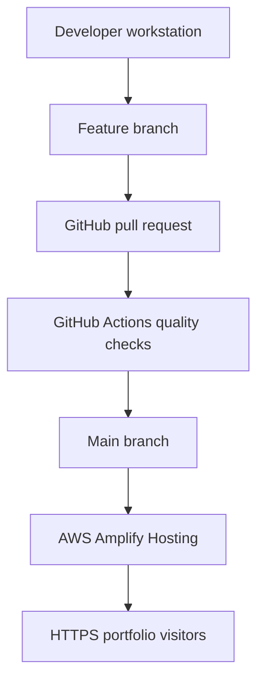

# Cloud Engineer Portfolio on AWS Amplify

A responsive professional portfolio built with Next.js and TypeScript, validated through GitHub Actions, and continuously deployed through AWS Amplify Hosting.

## Live Application

[View the deployed portfolio](https://main.dndkob0v40a0c.amplifyapp.com)

## Project Summary

This project addresses a professional and technical problem: cloud-engineering portfolios often describe skills without demonstrating the delivery systems behind them.

The application therefore serves two purposes:

1. Present cloud-engineering case studies in a clear, recruiter-friendly interface.
2. Demonstrate a working cloud delivery process using version control, pull-request validation, automated quality checks, and AWS hosting.

## Business Problem

The previous portfolio approach lacked:

- A centralized professional presentation
- Automated deployment
- Consistent synchronization with completed projects
- Evidence of CI/CD implementation
- A cloud-hosted delivery architecture
- A repeatable validation process

The solution needed to remain secure, maintainable, cost-conscious, and honest about what was—and was not—provisioned through Infrastructure as Code.

## Architecture



## Delivery Workflow

```text
Develop
→ Validate locally
→ Commit to feature branch
→ Open pull request
→ Run GitHub Actions
→ Merge to main
→ Trigger Amplify build
→ Deploy and verify
```

## Application Stack

### Frontend

- Next.js 15
- React 19
- TypeScript
- Tailwind CSS 4
- Responsive, semantic HTML
- Static page generation within an Amplify web-compute deployment

### Delivery

- Git
- GitHub
- Feature-branch workflow
- Pull requests
- GitHub Actions
- AWS Amplify Hosting
- Amplify GitHub App
- HTTPS through the Amplify default domain

### Runtime

- Node.js 22
- npm lockfile-based installation
- Amazon Linux 2023 Amplify build image

## Automated Quality Checks

The GitHub Actions workflow runs on pull requests and pushes to `main`.

It performs:

1. Repository checkout
2. Node.js configuration from `.nvmrc`
3. Clean dependency installation with `npm ci`
4. Production dependency audit
5. TypeScript validation
6. ESLint validation
7. Production application build

The workflow uses read-only repository permissions:

```yaml
permissions:
  contents: read
```

## Amplify Build Process

The repository-controlled `amplify.yml` performs:

```text
nvm use 22
npm ci
npm audit --omit=dev --audit-level=high
npm run build
```

Amplify deploys the `.next` build output and caches:

- `.next/cache`
- `node_modules`

The `main` branch is configured as the Amplify production branch with automatic builds enabled.

## Security Decisions

### GitHub Authorization

AWS Amplify was authorized through the regional Amplify GitHub App.

Repository access was limited to:

```text
thecloudengineer2026/cloud-engineer-portfolio
```

No GitHub personal access token was created, stored in Secrets Manager, placed in an environment variable, or passed through the command line.

### Dependency Security

The initial Next.js 15 scaffold contained a vulnerable nested PostCSS dependency.

The remediation:

- Retained Amplify-compatible Next.js 15
- Overrode PostCSS with patched version `8.5.26`
- Removed the vulnerable nested version
- Preserved successful linting and production builds
- Reduced `npm audit` findings to zero

### Amplify Logging Role

Amplify created a service role limited to CloudWatch Logs write access for:

```text
/aws/amplify/*
```

in:

```text
us-east-1
```

The role was not granted Amplify backend-administration permissions.

### Secrets

The application requires:

- No AWS credentials in the repository
- No GitHub personal access token
- No application secrets
- No deployment environment variables

## Infrastructure as Code Tradeoff

The original project brief called for the Amplify application and GitHub connection to be provisioned through AWS CDK.

Current AWS guidance recommends the Amplify GitHub App for repository access. However, CloudFormation, CDK, CLI, and SDK creation workflows still require a GitHub personal access token during initial application creation.

For this implementation, repository-scoped GitHub App authorization was prioritized over forcing complete Infrastructure as Code coverage through a long-lived token.

As a result:

- Application code and build configuration are version-controlled.
- CI validation is version-controlled.
- GitHub Actions is version-controlled.
- Amplify hosting and the initial GitHub connection were created through the AWS console.
- The exception is documented rather than represented as full IaC.

This was a deliberate security and maintainability decision.

## Validation Results

| Validation | Result |
|---|---|
| Node.js 22 clean installation | Passed |
| Production dependency audit | Passed |
| TypeScript validation | Passed |
| ESLint validation | Passed |
| Local production build | Passed |
| Desktop layout | Passed |
| Tablet layout | Passed |
| Mobile layout | Passed |
| Navigation links | Passed |
| External project links | Passed |
| LinkedIn and GitHub links | Passed |
| Email link | Passed |
| GitHub Actions pull-request workflow | Passed |
| GitHub Actions post-merge workflow | Passed |
| Amplify initial deployment | Passed |
| HTTPS application access | Passed |
| Amplify production branch | `main` |
| Amplify automatic builds | Enabled |

## Local Development

### Prerequisites

- Node.js 22
- npm
- Git

### Install

```bash
npm ci
```

### Start Development Server

```bash
npm run dev
```

Open:

```text
http://localhost:3000
```

### Validate

```bash
npx tsc --noEmit
npm run lint
npm audit
npm run build
```

## Repository Structure

```text
.github/workflows/quality.yml   GitHub Actions validation
src/app/                        Next.js application
src/data/portfolio.ts           Structured portfolio content
amplify.yml                     Amplify build specification
.gitattributes                  Cross-platform line-ending policy
.nvmrc                          Node.js runtime declaration
```

## Cost Considerations

Potential AWS charges include:

- Amplify build minutes
- Hosted data storage
- Data transfer
- Web-compute requests
- CloudWatch Logs storage and ingestion

Free Tier eligibility is not assumed.

The project currently avoids:

- A custom domain
- AWS WAF
- Additional Amplify branches
- Application databases
- Authentication services
- Amplify backend resources

## Current Limitations

- The application uses the default Amplify domain.
- The contact action opens the visitor’s email client.
- Portfolio content is updated through version-controlled source data.
- No content-management system is included.
- No application analytics platform is configured.
- Core Amplify provisioning is not currently managed through CDK.

## Key Outcome

The project demonstrates more than a hosted webpage.

It provides a traceable delivery system:

```text
Business problem
→ Application design
→ Local validation
→ Pull-request validation
→ Controlled merge
→ Automatic AWS deployment
→ Public HTTPS verification
```

The implementation shows how cloud engineering, business analysis, security judgment, automation, and technical communication can operate as one workflow.